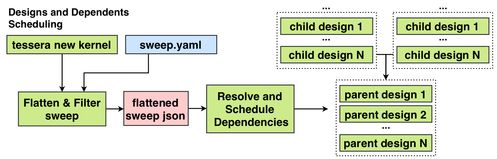
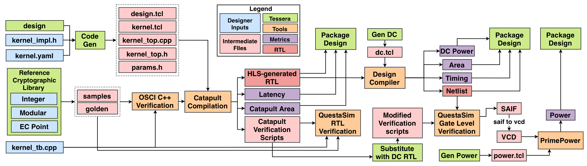

# [WIP] Tessera: A Framework for Cryptographic Hardware Kernels

Tessera is a fully automated design space exploration (DSE) framework for cryptographic hardware kernels, covering integer and modular arithmetic through elliptic curve point operations; kernels that dominate Zero-Knowledge Proofs (ZKPs) and Fully Homomorphic Encryption (FHE). A kernel is specified once in HLS C\++, and a sweep as a set of parameter values. Each combination is built through high level synthesis (HLS), logic synthesis and power analysis. A single testbench verifies the design at the C++, RTL and gate level against a reference implementation of the arithmetic, and the resulting area, latency and power measurements are collected into one table. Together these define a highly productive methodology for hardware DSE of cryptographic kernels.

## Setup

### Tool versions

Tessera is tested against the following tool and dependency versions:

* `Catapult HLS Ultra` - 2026.1
* `Catapult QuestaSim` - 2026.2
* `Synposys Design Compiler` - Y-2026.03
* `Synposys PrimePower` - Y-2026.03
* `Vivado` - 2026.1
* `Python` - 3.9.25

### Initial Setup
```
bash setup.sh

# Fill in config.yaml with the tool and library paths for your site.
cp config.yaml.tmp config.yaml
```

## Quick Start

```
.venv/bin/python -m tessera run l1_mod_add -s sweeps/l1_mod.yaml
.venv/bin/python -m tessera analyze l1_mod_add
```

- The first command also builds `l0_int_add` and `l0_int_sub`, because `l1_mod_add` blackboxes them
- The second prints one row per design, with what each stage measured
- `-t` sets the thread count
- `--dry-run` writes the files a tool would read, then stops
- `--dc-only` synthesizes an existing Catapult build again
- `--run-only` reuses the design list from the last run

## Tessera Flow
### Designs and Dependency Scheduling Flow Diagram


### Per-Design Flow Diagram


### ASIC

- **Catapult** — HLS C++ to RTL, and packages it with the ports, area, delay and latency a parent needs
- **Design Compiler** — RTL to a gate netlist, and estimates power from assumed switching
- **gate level simulation** — runs the same testbench against that netlist, and records the real switching activity
- **PrimePower** — measures power from that activity, which also gives peak and glitch power

### FPGA

- Vivado runs inside the Catapult run, so no stages follow it
- A `tech_type` that starts with `fpga` takes this flow
- Reports LUTs, FFs, DSPs and BRAMs instead of area
- _Note: Blackboxing is not supported here yet, so every dep is inlined_

## Concepts

### Kernels and designs

- **kernel** — one operation, such as `l1_mod_add`, in `kernels/<level>/<name>/`
- **design** — one point in a sweep, such as that kernel at bitwidth 32, period 1.0
- **sweep** — the parameters to build, and the flags that say how far to take them
- Levels: `l0` integer, `l1` modular, `l2` point, `l3` higher operations

### Packaging Kernels

- **package** — a built design's RTL and its manifest, which records ports, area, delay, latency and power
- **blackbox** — a parent reuses a dep's package instead of compiling the dep again
- Blackboxing keeps a large design inside what synthesis can handle
- A dep the kernel does not blackbox is inlined, and needs no build of its own
- Tessera builds the blackboxed deps itself, at the width and period the parent needs

## Writing a sweep

### Parameters

- Every list is crossed with the others, so 2 bitwidths and 3 periods build 6 designs
- `bitwidth`, `tech_type`, `period`, `ii`
- `curve`, `field`, `q_type`
- `dep_period_ratio` — a blackboxed dep is built at `period * ratio`

### Flags

- A flag turns on the stages it needs: `power` → `gls` → `syn` and `verify_rtl` → `test_cpp`
- `syn_sel` picks which designs are worth synthesizing:
  - `all` — every design
  - `pareto` — the designs on the area and latency frontier
  - `small_fast` — the smallest and the fastest of those
- Only designs that compute the same thing are compared, which `kernel_key` decides

## Adding a New Kernel

```
.venv/bin/python -m tessera new <kernel>
```

### The implementation

- `kernels/<level>/<name>/impl/<name>_impl.h`
- The class Tessera reads for its ports and its deps
- Template parameters take the design's values, such as `_FIELD::W`

### kernel.yaml

- `deps` — the kernels this one uses
- `blackbox` — which of those to reuse as packaged RTL
- `kernel_key` — the parameters that decide what the kernel computes, so two designs are only compared when one could replace the other
- `stages` — extra TCL per Catapult stage

### The testbench

- `kernels/<level>/<name>/<name>_tb.cpp` drives `CCS_DESIGN`
- `gen_samples.py` writes the samples and the golden outputs for the kernel
- Golden outputs come from `reference/`, a Python library of the same arithmetic: fields, curves, coordinates and reduction
- The same testbench checks the C++, the RTL and the gate netlist

## Authors
Gaurav Kuwar

## References